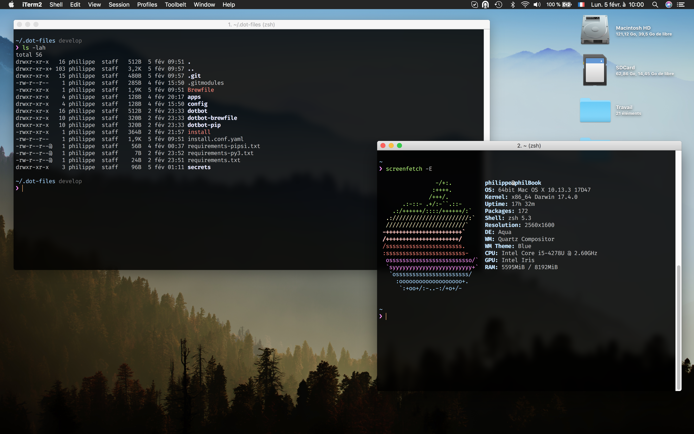

# Phil's dotfiles

## Contents

What's in there?

- all my `brew` dependencies including: applications, fonts, etc. See `Brewfile`
- all my `macOS` configuration. See `macos`
- all my `python` dependencies. See `config/python/`
- all my shell configuration. See `config/shell/` and `config/home/zshrc`
- all my `sublime-text3` configuration. See `app/sublime-text-3/`
- all my `iTerm2` configuration. See `app/iterm2/`

## Installation

We are using `dotbot` to handle any installations. Steps:

1. Clone this repo
2. `cd` into `dotfiles/` folder
3. Run `install` script

### Setting up SublimeText

You will need to do some extra steps with `sublime`:
1. Open an editor
2. Run this command in "Command Palette": `Package Control: Satisfy Dependencies`
3. Restart `sublime`

## Local configuration

Some of the used tools requires local configuration. Such as `git` with username and email.

Here's the full list:

1. `git`

    1.1 `~/.gitconfig_local` to store any user-specific data

2. `shell`

    2.1 `~/.shell_env_local` to store local shell config, like: usernames, passwords, tokens, `gpg` keys and so on

## License

[WTFPL](https://en.wikipedia.org/wiki/WTFPL): do the fuck you want. Enjoy!
